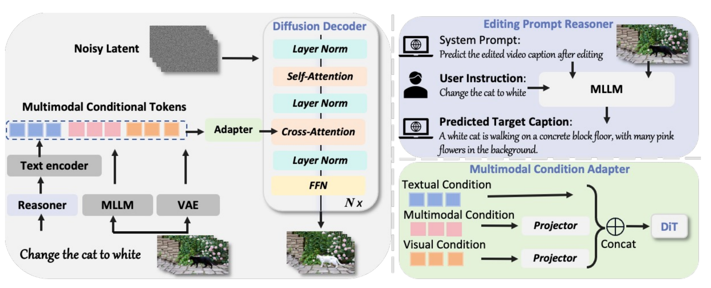

<h1 align="center"><span style="color: #7C3AED;">Omni-Video 2</span></h1>

<h3 align="center"><b>A flexible framework to bridge video understanding, generation and editing</b></h3>

<p align="center">
    <a href="https://howellyoung-s.github.io/Omni-Video2-project/">
        
    </a>
    &nbsp;
    <a href="https://huggingface.co/Fudan-FUXI/OmniVideo2-A14B">
        
    </a>
</p>

<p align="center">
Hao Yang<sup>2</sup>, 
Zhiyu Tan<sup>1,2†</sup>, 
Jia Gong<sup>2</sup>, 
Luozheng Qin<sup>2</sup>, 
Hesen Chen<sup>1,2</sup>, 
Xiaomeng Yang<sup>2</sup>, 
Yuqing Sun<sup>2</sup>, 
Yuetan Lin<sup>2</sup>, 
Mengping Yang<sup>2*</sup>, 
Hao Li<sup>1,2*</sup>
</p>

<p align="center">
<sup>1</sup>Fudan University &nbsp;|&nbsp; <sup>2</sup>Shanghai Academy of Artificial Intelligence for Science 
<br>
<sup>*</sup>Corresponding Author &nbsp;&nbsp; <sup>†</sup>Project Lead
</p>

---

## 🔥 Latest News

- **January 22, 2026**: 🔥🔥 The whole new **Omni-Video 2** is coming!
- **August 6, 2025**: We are glad to release v0.1's code, which includes support for both inference and fine-tuning!
- **August 6, 2025**: Our version v0.1 model is uploaded to [HF Model](https://huggingface.co/Fudan-FUXI/OmniVideo2-A14B) now!
- **July 7, 2025**: We release the Technique-Report of Omni-Video
- **July 7, 2025**: We release the [project page](https://howellyoung-s.github.io/Omni-Video2-project/) of Omni-Video

---

## Introduction

We present a unified video editing and generation framework that pairs a text-to-video DiT backbone with vision-language understanding for precise, controllable edits. A VLM reads the source video and edit instruction to predict a detailed caption of the expected edited result, converting sparse prompts into explicit semantics about content, attributes, and temporal changes. The DiT model then uses mixed cross-attention conditioning, injecting source VAE latents (optionally concatenated with other cues) together with the expanded text semantics, to preserve identity, layout, and motion while enabling flexible control. This yields a single pipeline that supports text-to-video, video-to-video editing, and mixed-condition generation.

## Framework

<p align="center">

</p>

---

## Video Editing Demos

> **Note:** Left side shows the source video, right side shows the edited result.

### Advanced Video Editing

#### Complex Edit
*Multi-element transformations combining appearance, lighting, and environmental changes.*

<table>
<tr>
<td width="50%">

*Change the man's black jacket to a tattered gray overcoat, replace the wall with faded blue wallpaper*


</td>
<td width="50%">

*Change the woman's red shirt to glowing neon cyan, transform window glow to electric blue moonlight*


</td>
</tr>
<tr>
<td width="50%">

*Change the man's black jacket to a gray coat with glowing thread, replace blue light with warm amber*


</td>
<td width="50%">

*Change workout attire to vibrant crimson sports bra and leggings, replace towel with flowing silk scarf*


</td>
</tr>
</table>

#### High Motion
*Challenging edits on fast-moving subjects with dynamic clothing and dramatic motion.*

<table>
<tr>
<td width="50%">

*Change the woman's black top to a flowing blood-red silk gown that billows with motion*


</td>
<td width="50%">

*Change the woman's green jacket to a deep crimson cloak that billows dramatically*


</td>
</tr>
<tr>
<td width="50%">

*Change the armored suit from red-and-black to matte charcoal gray with cyan circuitry accents*


</td>
<td width="50%">

*Change the woman's white shirt to a blood-red silk blouse that clings to her form*


</td>
</tr>
</table>

#### Diverse Local Edit
*Precise object-level modifications while preserving surrounding context and motion.*

<table>
<tr>
<td width="50%">

*Change the real raccoon to a stuffed raccoon*


</td>
<td width="50%">

*Change the firefighter's pizza to a steaming cup of coffee*


</td>
</tr>
<tr>
<td width="50%">

*Change the light brown fur to deep obsidian-black fur with icy blue ethereal mist*


</td>
<td width="50%">

*Change the golden retriever to a black Labrador*


</td>
</tr>
</table>

---

### Basic Video Editing

#### Add
*Adding objects and accessories to videos.*

<table>
<tr>
<td width="50%">

*Add a scarf around the first fox's neck*


</td>
<td width="50%">

*Add a tiny pirate hat on the parrot's head*


</td>
</tr>
<tr>
<td width="50%">

*Add a red headband to the player's forehead*


</td>
<td width="50%">

*Add a tiny crown to the hummingbird's head*


</td>
</tr>
</table>

#### Remove
*Removing elements from videos while maintaining scene coherence.*

<table>
<tr>
<td width="50%">

*Remove the meditation cushion from the scene*


</td>
<td width="50%">

*Remove the two cubs from the scene*


</td>
</tr>
<tr>
<td width="50%">

*Remove the two lizards from the scene*


</td>
<td width="50%">

*Remove the black cat from the scene*


</td>
</tr>
</table>

#### Local Change
*Local attribute changes on specific objects.*

<table>
<tr>
<td width="50%">

*Change the woman's white dress to a blood-stained black gown*


</td>
<td width="50%">

*Change the fox into a badger*


</td>
</tr>
<tr>
<td width="50%">

*Change the man with thick beard to a woman with short silver hair*


</td>
<td width="50%">

*Change the engineer's navy jacket to a bright crimson trench coat*


</td>
</tr>
</table>

## Project Structure

```
omnivideo2_release/
├── omnivideo/
│   ├── configs/           # Model configurations
│   ├── distributed/       # FSDP and sequence parallel utilities
│   ├── modules/           # Core model components (attention, VAE, T5, etc.)
│   ├── utils/             # Utility functions and solvers
│   ├── vllm_model.py      # Qwen3-VL integration
│   └── x2x_gen_unified.py # Main generation pipeline
└── tools/
    └── inference/
        ├── generate_omni_v2v.py    # Inference script
        └── inference_omni_v2v.sh   # Shell launcher
```

## Environment Setup

### Requirements

- Python >= 3.10
- PyTorch >= 2.8 with CUDA support
- NVIDIA GPU with sufficient VRAM (recommended: 80GB for A14B model)

### Installation

1. Clone the repository:
```bash
git clone https://github.com/your-org/omnivideo2.git
cd omnivideo2
```

2. Create a conda environment:
```bash
conda create -n omnivideo2 python=3.10
conda activate omnivideo2
```

3. Install dependencies:
```bash
pip install -r requirements.txt
pip install flash-attn --no-build-isolation  # Optional but recommended for faster attention
```

## Model Checkpoints

Download the pretrained checkpoints and organize them as follows:

```
${CKPT_DIR}/
├── high_noise_model/
│   └── model.pt              # High-noise timestep model
├── low_noise_model/
│   └── model.pt              # Low-noise timestep model
├── special_tokens.pkl        # Special token embeddings
├── models_t5_umt5-xxl-enc-bf16.pth  # T5 encoder
└── Wan2.1_VAE.pth            # VAE model
```

You will also need the Qwen3-VL model for visual feature extraction:
- Download from: [Qwen3-VL-30B-A3B-Instruct](https://huggingface.co/Qwen/Qwen3-VL-30B-A3B-Instruct)

## Inference

### Prepare Input Data

Create a JSONL file with your prompts. Each line should be a JSON object:

**For Video-to-Video editing:**
```json
{"sample_id": "001", "edit_prompt": "Change the dog to a cat", "source_clip_path": "/path/to/source_video.mp4"}
```


### Run Inference

1. Edit the configuration in `tools/inference/inference_omni_e2e.sh`:

```bash
# Update these paths
CKPT_DIR="/path/to/your/checkpoints"
QWEN3VL_MODEL_PATH="/path/to/Qwen3-VL-30B-A3B-Instruct"
DATA_FILE="/path/to/your/prompts.jsonl"

# Adjust generation parameters as needed
GEN_SIZE="832*480"       # Video resolution (width*height)
GEN_FRAME_NUM=41         # Number of frames
GEN_SAMPLE_FPS=8         # Output FPS
GEN_TASK="v2v-A14B"      # Task type: v2v-A14B or t2v-A14B
```

2. Run the inference script:

```bash
bash tools/inference/inference_omni_e2e.sh
```

### Available Tasks

| Task | Description |
|------|-------------|
| `t2v-A14B` | Text-to-Video generation with A14B model |
| `v2v-A14B` | Video-to-Video editing with A14B model |

### Generation Parameters

| Parameter | Default | Description |
|-----------|---------|-------------|
| `--size` | `832*480` | Output video resolution (width*height) |
| `--frame_num` | `41` | Number of frames to generate |
| `--sample_fps` | `8` | Output video FPS |
| `--sample_steps` | `40` | Number of diffusion sampling steps |
| `--sample_guide_scale` | `3.0` | Classifier-free guidance scale |
| `--sample_shift` | `5` | Noise schedule shift parameter |
| `--sample_solver` | `unipc` | Sampling solver (unipc, ddim, euler) |

## Acknowledgements

We sincerely thank the following teams for their outstanding contributions that made this project possible:

- **[Wan Team](https://github.com/Wan-Video/Wan2.1)**: For the foundational video generation architecture, VAE model, and diffusion framework.

- **[Qwen-VL Team](https://github.com/QwenLM/Qwen-VL)**: For the powerful Qwen3-VL vision-language model.

## License

Please refer to the LICENSE file for details.

## Citation

If you find this work useful, please consider citing:

```bibtex
@misc{omnivideo2,
  title={OmniVideo2: Unified Video Generation and Editing},
  year={2026},
  publisher={GitHub},
  url={https://github.com/SAIS-FUXI/Omni-Video}
}
@article{tan2025omni,
  title={Omni-Video: Democratizing Unified Video Understanding and Generation},
  author={Tan, Zhiyu and Yang, Hao and Qin, Luozheng and Gong, Jia and Yang, Mengping and Li, Hao},
  journal={arXiv preprint arXiv:2507.06119},
  year={2025}
}
```