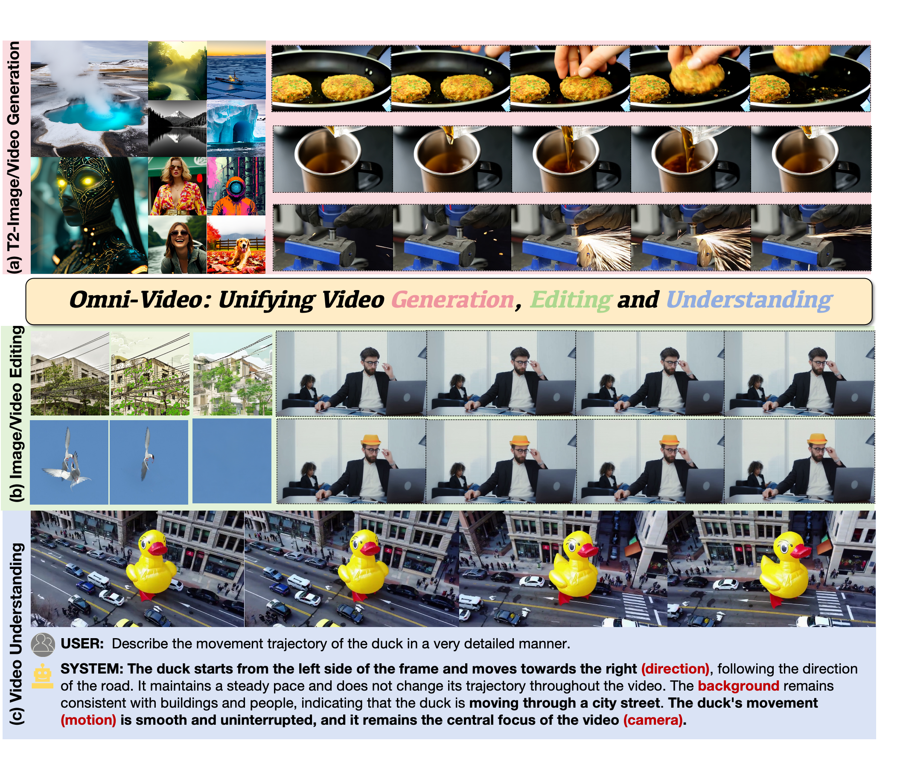
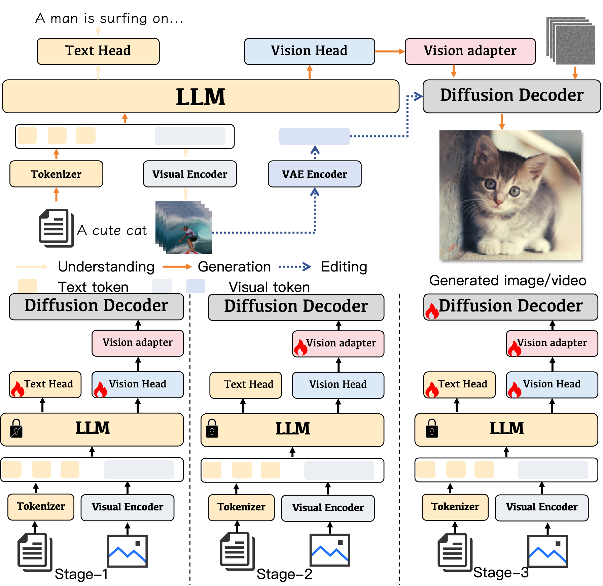

<div align="center">
<h1>Omni-Video: Democratizing Unified Video Understanding and Generation</h1>


[Zhiyu Tan*](https://openreview.net/profile?id=~Zhiyu_Tan1) · [Hao Yang*](https://openreview.net/profile?id=~Yang_Hao4) ·[Luozheng Qin](https://openreview.net/profile?id=~Luozheng_Qin1) · [Jia Gong](https://scholar.google.com/citations?user=ZV-ThegAAAAJ&hl=zh-CN&oi=ao) · [Mengping Yang](https://scholar.google.com/citations?user=yF34LtcAAAAJ&hl=zh-CN)<sup>&#9993;</sup> · [Hao Li](https://scholar.google.com/citations?user=pHN-QIwAAAAJ&hl=zh-CN)  <sup>&#9993;</sup>

<sup>*</sup>Equal Contribution
<sup>&#9993;</sup>Corresponding Authors


<a href='https://howellyoung-s.github.io/OmniVideo_project/'></a>
<a href='https://arxiv.org/pdf/2507.06119'></a>
<a href='https://howellyoung-s.github.io/OmniVideo_project/'></a>

</div>

> **TL; DR:**  ***Omini-Video*** is a video unified model that enables various video tasks including video understanding, generation editing within a single framework.

 

## Abstract 
Notable breakthroughs in unified understanding and generation modeling have led to remarkable advancements in image understanding, reasoning, production and editing, yet current foundational models predominantly focus on processing images, creating a gap in the development of unified models for video understanding and generation. This report presents ***Omni-Video***, an efficient and effective unified framework for video understanding, generation, as well as instruction-based editing. Our key insight is to teach existing multimodal large language models (MLLMs) to produce continuous visual clues that are used as the input of diffusion decoders, which produce high-quality videos conditioned on these visual clues. To fully unlock the potential of our system for unified video modeling, we integrate several technical improvements: 1) a lightweight architectural design that respectively attaches a vision head on the top of MLLMs and a adapter before the input of diffusion decoders, the former produce visual tokens for the latter, which adapts these visual tokens to the conditional space of diffusion decoders; and 2) an efficient multi-stage training scheme that facilitates a fast connection between MLLMs and diffusion decoders with limited data and computational resources. We empirically demonstrate that our model exhibits satisfactory generalization abilities across video generation, editing and understanding tasks.

 

## 🔥 Latest News

* Jul 15, 2025: 🔥🔥 We are actively organizing our code and will make our code public available in the next few weeks, stay tuned!
* Jul 07, 2025: We release the [Technique-Report](https://arxiv.org/pdf/2507.06119) of **Omni-Video** 
* Jul 07, 2025: We release the [project page](https://howellyoung-s.github.io/OmniVideo_project/) of **Omni-Video** 


## Demos

### Text-to-image
 

### Image-to-image Editing
<table border="0" style="width: 100%; text-align: left; margin-top: 20px;">
  <tr>
      <td>
          
      </td>
      <td>
          
      </td>
  </tr>
  <tr>
      <td>
          
      </td>
      <td>
          
      </td>
  </tr>
  <tr>
      <td>
          
      </td>
      <td>
          
      </td>
  </tr>
  <tr>
      <td>
          
      </td>
      <td>
          
      </td>
  </tr>
</table>


### Text-to-video

<table border="0" style="width: 100%; text-align: left; margin-top: 20px;">
  <tr>
      <td>
          <video src="https://1drv.ms/v/c/333fd699e1fb0d7d/EclQ1wTA3aVFvxcC4z1y97UBLwWlPcp9Vcb32ju6vg6Emw?e=eWi8Lv" width="320" controls loop></video>
      </td>
      <td>
          <video src="https://1drv.ms/v/c/333fd699e1fb0d7d/EclQ1wTA3aVFvxcC4z1y97UBLwWlPcp9Vcb32ju6vg6Emw?e=eWi8Lv" width="320" controls loop></video>
      </td>
       <td>
          <video src="./assets/t2v/003.mp4" width="320" controls loop></video>
     </td>
  </tr>
  <tr>
      <td>
          <video src="./assets/t2v/004.mp4" width="320" controls loop></video>
      </td>
      <td>
          <video src="./assets/t2v/005.mp4" width="320" controls loop></video>
      </td>
       <td>
          <video src="./assets/t2v/006.mp4" width="320" controls loop></video>
     </td>
  </tr>
  <tr>
      <td>
          <video src="./assets/t2v/007.mp4" width="320" controls loop></video>
      </td>
      <td>
          <video src="./assets/t2v/008.mp4" width="320" controls loop></video>
      </td>
       <td>
          <video src="./assets/t2v/009.mp4" width="320" controls loop></video>
     </td>
  </tr>
</table>

### Video-to-Video

<table border="0" style="width: 100%; text-align: left; margin-top: 20px;">
  <tr>
      <td>
          <video src="./assets/v2v/concat_0.mp4" width="1000" controls loop></video>
      </td>
      <td>
          <video src="./assets/v2v/concat_1.mp4" width="1000" controls loop></video>
      </td>
  </tr>
  <tr>
      <td>
          <video src="./assets/v2v/concat_2.mp4" width="1000" controls loop></video>
      </td>
      <td>
          <video src="./assets/v2v/concat_3.mp4" width="1000" controls loop></video>
      </td>
  </tr>
  <tr>
      <td>
          <video src="./assets/v2v/concat_4.mp4" width="1000" controls loop></video>
      </td>
      <td>
          <video src="./assets/v2v/concat_5.mp4" width="1000" controls loop></video>
      </td>
  </tr>
</table>


## BibTex

```bibtex
@article{tan2025omni,
  title={Omni-Video: Democratizing Unified Video Understanding and Generation},
  author={Tan, Zhiyu and Yang, Hao and Qin, Luozheng and Gong, Jia and Yang, Mengping and Li, Hao},
  journal={arXiv preprint arXiv:2507.06119},
  year={2025}
}
```