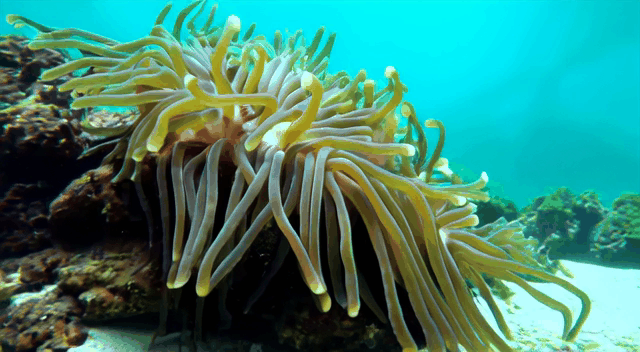

<div align="center">
<h1>Omni-Video: Democratizing Unified Video Understanding and Generation</h1>


[Zhiyu Tan*](https://openreview.net/profile?id=~Zhiyu_Tan1) · [Hao Yang*](https://openreview.net/profile?id=~Yang_Hao4) ·[Luozheng Qin](https://openreview.net/profile?id=~Luozheng_Qin1) · [Jia Gong](https://scholar.google.com/citations?user=ZV-ThegAAAAJ&hl=zh-CN&oi=ao) · [Mengping Yang](https://scholar.google.com/citations?user=yF34LtcAAAAJ&hl=zh-CN)<sup>&#9993;</sup> · [Hao Li](https://scholar.google.com/citations?user=pHN-QIwAAAAJ&hl=zh-CN)  <sup>&#9993;</sup>

<sup>*</sup>Equal Contribution
<sup>&#9993;</sup>Corresponding Authors


<a href='https://howellyoung-s.github.io/OmniVideo_project/'></a>
<a href='https://arxiv.org/pdf/2507.06119'></a>
<a href='https://huggingface.co/howellyoung1/OmniVideo11B/tree/main'></a>

</div>

> **TL; DR:**  ***Omini-Video*** is a video unified model that enables various video tasks including video understanding, generation editing within a single framework.

 

## 🔥 Latest News
* August 6, 2025: 🔥🔥 We are glad to release our code, which includes support for both inference and fine-tuning!
* August 6, 2025: 🔥🔥 Our version v0.1 model is uploaded to [HF Model](https://huggingface.co/howellyoung1/OmniVideo11B/tree/main) now!
* Jul 07, 2025: We release the [Technique-Report](https://arxiv.org/pdf/2507.06119) of **Omni-Video** 
* Jul 07, 2025: We release the [project page](https://howellyoung-s.github.io/OmniVideo_project/) of **Omni-Video**

## 📑 Tasks supported by the unified Omni-Video
- Visual understanding
    - [✔] Image understanding
    - [✔] Video understanding
- Visual generation
    - [✔] Text-to-Video generation
    - [✔] Text-to-Image generation
    - [✔] Video-to-Video editting
    - [✔] Image-to-Image editting

## 🚀 Quick Start

### Inference
```bash
# Run inference with sample data
bash tools/inference/inference.sh
```

### Training
```bash
# Quick training with sample data
# Sample data are availabe in examples/finetune_data
bash finetune.sh
```
For detailed usage instructions, please refer to the `SETUP_MODELS.md`.

## Abstract 
Notable breakthroughs in unified understanding and generation modeling have led to remarkable advancements in image understanding, reasoning, production and editing, yet current foundational models predominantly focus on processing images, creating a gap in the development of unified models for video understanding and generation. This report presents ***Omni-Video***, an efficient and effective unified framework for video understanding, generation, as well as instruction-based editing. Our key insight is to teach existing multimodal large language models (MLLMs) to produce continuous visual clues that are used as the input of diffusion decoders, which produce high-quality videos conditioned on these visual clues. To fully unlock the potential of our system for unified video modeling, we integrate several technical improvements: 1) a lightweight architectural design that respectively attaches a vision head on the top of MLLMs and a adapter before the input of diffusion decoders, the former produce visual tokens for the latter, which adapts these visual tokens to the conditional space of diffusion decoders; and 2) an efficient multi-stage training scheme that facilitates a fast connection between MLLMs and diffusion decoders with limited data and computational resources. We empirically demonstrate that our model exhibits satisfactory generalization abilities across video generation, editing and understanding tasks.

 


## Demos

### Text-to-video

<table border="0" style="width: 100%; text-align: left; margin-top: 20px;">
  <tr>
      <td>
          
      </td>
      <td>
          
      </td>
      <td>
          
      </td>
  </tr>
  <tr>
      <td>
          
      </td>
      <td>
          
      </td>
      <td>
          
      </td>
  </tr>
  <tr>
      <td>
          
      </td>
      <td>
          
      </td>
      <td>
          
      </td>
  </tr>
</table>

### Video-to-Video
Our model offers video editing capabilities. While its generalization may not always be optimal due to the high cost of training data, multiple sampling can often improve results. For better performance, fine-tuning with high-quality data is also a recommended option.

group 1:
<table border="0" style="width: 100%; text-align: left; margin-top: 20px;">
  <tr>
      <td>
          <video width="400" controls>
              <source src="./assets/v2v/v2v_demo_001.mp4" type="video/mp4">
              Your browser does not support the video tag.
          </video>
      </td>
      <td>
          <video width="400" controls>
              <source src="./assets/v2v/v2v_demo_002.mp4" type="video/mp4">
              Your browser does not support the video tag.
          </video>
      </td>
  </tr>
  <tr>
      <td>
          <video width="400" controls>
              <source src="./assets/v2v/v2v_demo_003.mp4" type="video/mp4">
              Your browser does not support the video tag.
          </video>
      </td>
      <td>
          <video width="400" controls>
              <source src="./assets/v2v/v2v_demo_004.mp4" type="video/mp4">
              Your browser does not support the video tag.
          </video>
      </td>
  </tr>
  <tr>
      <td>
          <video width="400" controls>
              <source src="./assets/v2v/v2v_demo_005.mp4" type="video/mp4">
              Your browser does not support the video tag.
          </video>
      </td>
      <td>
          <video width="400" controls>
              <source src="./assets/v2v/v2v_demo_006.mp4" type="video/mp4">
              Your browser does not support the video tag.
          </video>
      </td>
  </tr>
</table>


group 2:
<table border="0" style="width: 100%; text-align: left; margin-top: 20px;">
  <tr>
      <td>
          
      </td>
      <td>
          
      </td>
  </tr>
  <tr>
      <td>
          
      </td>
      <td>
          
      </td>
  </tr>
  <tr>
      <td>
          
      </td>
      <td>
          
      </td>
  </tr>
</table>

### Text-to-image
 

### Image-to-image Editing
<table border="0" style="width: 100%; text-align: left; margin-top: 20px;">
  <tr>
      <td>
          
      </td>
      <td>
          
      </td>
  </tr>
  <tr>
      <td>
          
      </td>
      <td>
          
      </td>
  </tr>
  <tr>
      <td>
          
      </td>
      <td>
          
      </td>
  </tr>
  <tr>
      <td>
          
      </td>
      <td>
          
      </td>
  </tr>
</table>


## Acknowledgement
We would like to thank [VILA](https://github.com/NVlabs/VILA) and [Wan2.1](https://github.com/Wan-Video/Wan2.1) for their excellent work. 

## BibTex

```bibtex
@article{tan2025omni,
  title={Omni-Video: Democratizing Unified Video Understanding and Generation},
  author={Tan, Zhiyu and Yang, Hao and Qin, Luozheng and Gong, Jia and Yang, Mengping and Li, Hao},
  journal={arXiv preprint arXiv:2507.06119},
  year={2025}
}
```